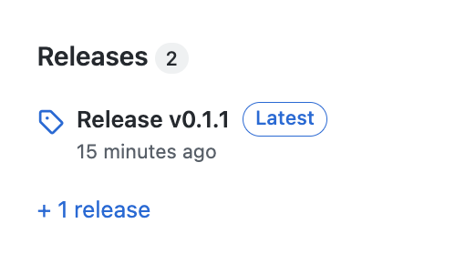
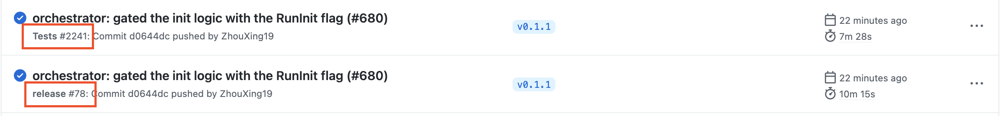

# Release steps

0. Double check if the new version (denoted by `v_{n+1}`) is correct.

## In `crdb-proxy` Repo github page
1. Click the `Releases` on the right hand side of the github page of the repo.
   
2. Click on `Draft a new release`. 
3. On `Choose a tag`, create a new tag with `v_{n+1}`. Fill in the Release Title with `Release: v_{n+1}`, click on `Generate release note`, and then click `Publish Release`.
4. Go to the `Action` page, you will see a `testing` and a `release` job are created. Click into the `release` job and approve the deployment.
   
5. While waiting for the `release cli` and `release docker image` to finish, you can proceed with steps for the `molt-helm-charts` repo as in the following section.

## In `molt-helm-charts` Repo
1. In `lms/templates/Chart.yaml`, update the `version` and `appVersion` to `v_{n+1}`.
2. In `lms/templates/values.yaml`, update the `tag` for image `cockroachdb/molt-lms` to `v_{n+1}`.
3. Make a new PR with these changes, and merge it upon approval. 
4. Similar to in `crdb-proxy` Repo, go to the `Release` section on the github page of the repo.
5. Click on `Draft a new release`. On `Choose a tag`, create a new tag with `v_{n+1}`. Fill in the Release Title with `Release: v_{n+1}`, click on `Generate release note`, and then click `Publish Release`.
6. Go to the `Action` page, you will see a `release` job is created but blocked upon a manual approval. _**DON'T APPROVE IT UNTIL ALL STEPS IN THE RELEASE JOB IN `crdb-proxy` HAVE FINISHED (i.e. wait for step 5 in the `In crdb-proxy Repo github page` section to finish).**_
7. When step 5 in `crdb-proxy` repo finishes, double check if `v_{n+1}` shows up in https://hub.docker.com/repository/docker/cockroachdb/molt-lms/general.
8. Approve the deployment of release job in the `molt-helm-charts` repo.
9. Verification: run `helm search repo lms` to see if `v_{n+1}` shows up.
